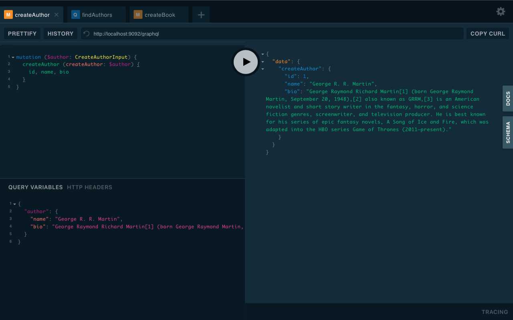
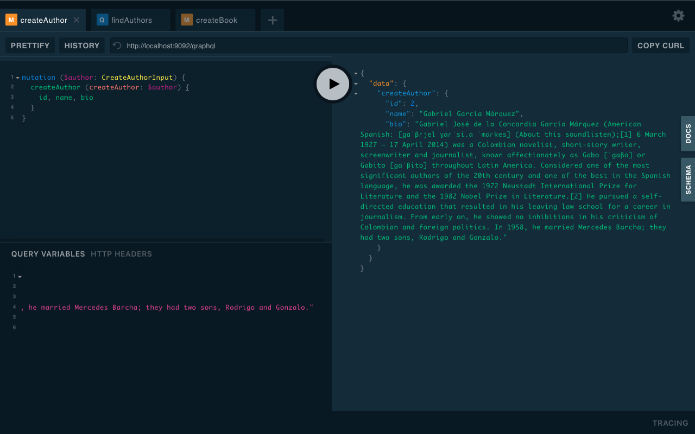
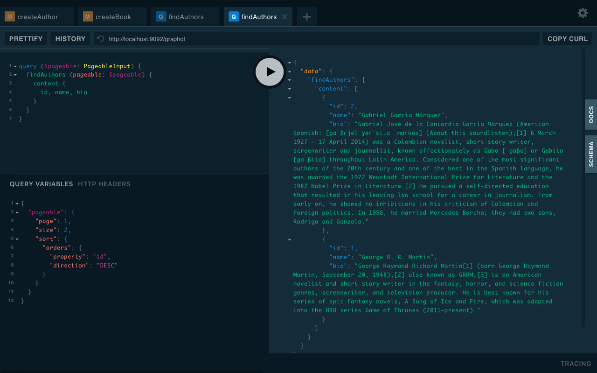
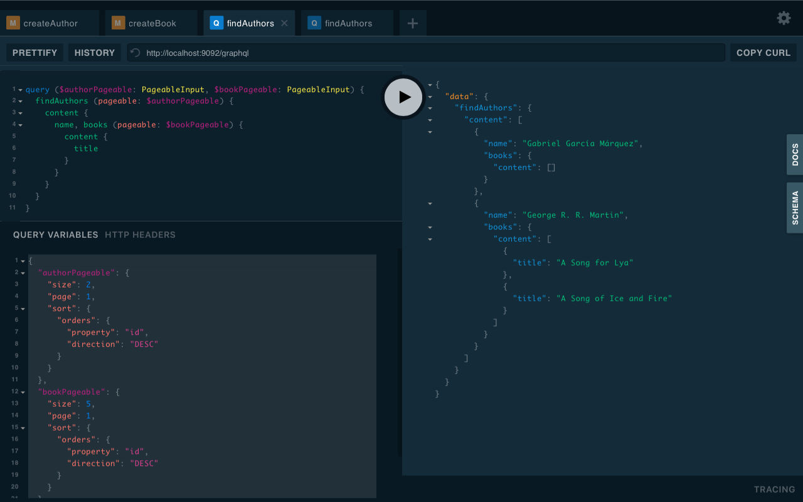

# Spring Boot GraphQL Quick Start Template

This is a minimal yet complete and runnable project that gets you quickly start to build a project
with GraphQL.

## How To Run

- Clone the code to your local machine:

```shell
git clone git@github.com:quick-start-templates/spring-boot-graphql.git
```

- Run it:

```shell
mvn spring-boot:run
```

- Play with it:

Open your browser and navigate to http://localhost:9092/gui

## Create Authors

In the left top panel, type the following GraphQL:

GraphQL:

```graphql
mutation ($author: CreateAuthorInput) {
  createAuthor (createAuthor: $author) {
    id, name, bio
  }
}
```

in the left bottom panel, click the **QUERY VARIABLES** to show the input panel for variables, and
type the following variables:

Variables:

```json
{
  "author": {
    "name": "George R. R. Martin",
    "bio": "George Raymond Richard Martin[1] (born George Raymond Martin, September 20, 1948),[2] also known as GRRM,[3] is an American novelist and short story writer in the fantasy, horror, and science fiction genres, screenwriter, and television producer. He is best known for his series of epic fantasy novels, A Song of Ice and Fire, which was adapted into the HBO series Game of Thrones (2011–present)."
  }
}
```

click the rounded triangle button in the middle to perform the request.



Change the variables into:

Variables:

```json
{
  "author": {
    "name": "Gabriel García Márquez",
    "bio": "Gabriel José de la Concordia García Márquez (American Spanish: [ɡaˈβɾjel ɣaɾˈsi.a ˈmaɾkes] (About this soundlisten);[1] 6 March 1927 – 17 April 2014) was a Colombian novelist, short-story writer, screenwriter and journalist, known affectionately as Gabo [ˈɡaβo] or Gabito [ɡaˈβito] throughout Latin America. Considered one of the most significant authors of the 20th century and one of the best in the Spanish language, he was awarded the 1972 Neustadt International Prize for Literature and the 1982 Nobel Prize in Literature.[2] He pursued a self-directed education that resulted in his leaving law school for a career in journalism. From early on, he showed no inhibitions in his criticism of Colombian and foreign politics. In 1958, he married Mercedes Barcha; they had two sons, Rodrigo and Gonzalo."
  }
}
```

and hit the button again to create another author.



## Create Books

Click the **+** button in the top bar to create another tab, and type the GraphQL in the left top panel:

GraphQL:

```graphql
mutation ($book: CreateBookInput) {
  createBook (createBook: $book) {
    id
  }
}
```

and type the variables:

Variables:

```json
{
  "book": {
    "title": "A Song of Ice and Fire",
    "authorId": 1,
    "isbn": "9788956606910",
    "description": "A Song of Ice and Fire is a series of epic fantasy novels by the American novelist and screenwriter George R. R. Martin. He began the first volume of the series, A Game of Thrones, in 1991, and it was published in 1996. Martin, who initially envisioned the series as a trilogy, has published five out of a planned seven volumes. The fifth and most recent volume of the series published in 2011, A Dance with Dragons, took Martin six years to write. He is currently writing the sixth novel, The Winds of Winter."
  }
}
```

and hit the button to create the book.

Change the variables to:

Variables:

```json
{
  "book": {
    "title": "A Song for Lya",
    "authorId": 1,
    "isbn": "9785457600294",
    "description": "A Song For Lya is a science fiction novella by American writer George R.R. Martin. It was published in Analog Science Fiction and Fact magazine in 1974 and won the Hugo Award for Best Novella in 1975. It was also nominated for the 1975 Nebula Award for Best Novella and Jupiter Award for Best Novella, and took second place in the Locus Poll."
  }
}
```

and hit the button again to create another book.

## Query!!

- Find all authors, we only want to display their names:

GraphQL:

```graphql
query {
  findAuthors {
    content {
      name
    }
  }
}
```

- now we need more information about them:

GraphQL:

```graphql
query {
  findAuthors {
    content {
      name, bio
    }
  }
}
```




- what if there are many authors and we want pagination with sort:

GraphQL:

```graphql
query ($pageable: PageableInput) {
  findAuthors (pageable: $pageable) {
    content {
      name
    }
  }
}
```

Variables:

```json
{
  "pageable": {
    "size": 1,
    "page": 1,
    "sort": {
      "orders": {
        "property": "id",
        "direction": "DESC"
      }
    }
  }
}
```

- now we want to return the top 5 books of each author:

GraphQL:

```graphql
query ($pageable: PageableInput) {
  findAuthors (pageable: $pageable) {
    content {
      name, books {
        content {
          title
        }
      }
    }
  }
}
```

Variables:

```json
{
  "authorPageable": {
    "size": 2,
    "page": 1,
    "sort": {
      "orders": {
        "property": "id",
        "direction": "DESC"
      }
    }
  },
  "bookPageable": {
    "size": 5,
    "page": 1,
    "sort": {
      "orders": {
        "property": "id",
        "direction": "DESC"
      }
    }
  }
}
```




## Contribution

Leave a star if you find it helpful to you
